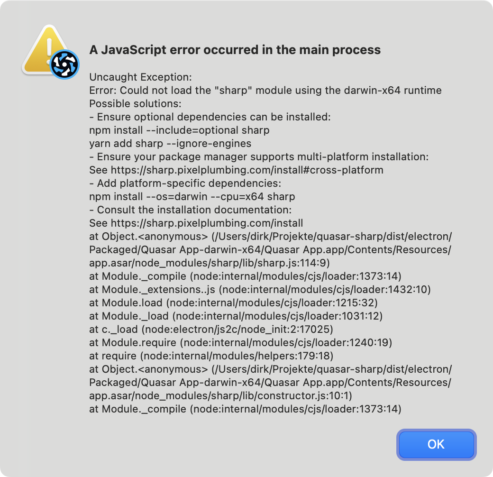

# Quasar App (quasar-sharp)

A Quasar Project to find out how to include native modules like sharp into an Electron app.

It works when running in dev mode, but not packaged:


I tried to follow the advices given on the sharp website (links see below) and tinkered with more on my original project. I just wanted to keep this demo relatively clean.

## Project Scaffolding

- `yarn create quasar`
- Accept all defaults (Quasar CLI with Vite)
- `quasar mode add electron`

### Additions for sharp

- `yarn add sharp --ignore-engines` (`--ignore-engines` is recommended for yarn v1)

- Added sharp test call to electron-main.js -> Runs in dev mode, but not as packaged build.
- Added unpack options to `quasar.config.js`, both to packager and to builder sections.

### Infos on Adding sharp

- [sharp and Electron](https://sharp.pixelplumbing.com/install#electron). Where to put these build options? Into `quasar.config.js` under electron - packager?
- [asarUnpack](https://github.com/lovell/sharp/issues/3985). Does not work with packager?
- [Configuring Electron](https://quasar.dev/quasar-cli-vite/developing-electron-apps/configuring-electron)

### Questions

- Do I need to use builder instead of packager? I tried it, but it made no difference.
- Do I need yarn v3 (lovell: "_My current advice to anyone working on multi or cross platform Node.js apps is to use either yarn 3+ or pnpm to manage dependencies via the supportedArchitectures feature._")?

## General Info

### Start the app in development mode (hot-code reloading, error reporting, etc.)

```bash
quasar dev -m electron
```

### Build the app for production

```bash
quasar build -m electron
```

### Customize the configuration

See [Configuring quasar.config.js](https://v2.quasar.dev/quasar-cli-vite/quasar-config-js).
